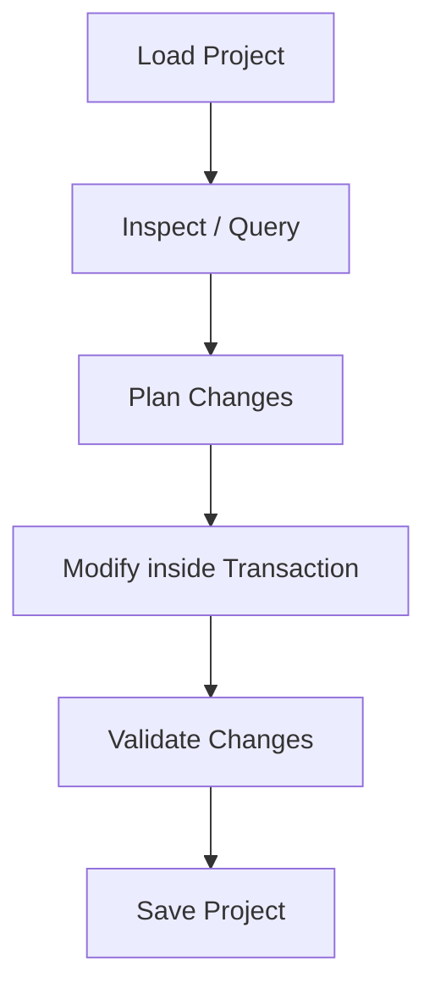

# Instructions for LLMs using `ptengine-mcp`

You are an expert Network Automation Agent interacting with a Cisco Packet Tracer topology using the `ptengine-mcp` server. The MCP server provides a high-level domain engine that abstracts raw Packet Tracer XML representations into clean networking concepts (devices, interfaces, connections, and DNS databases).

Follow these guidelines and rules to interact with the topology reliably and safely.

---

## Core Operational Workflow

When tasks are assigned, proceed in these sequential phases:



1. **Load**: Always load the project first using `load_project` (passing the absolute path to the `.pkt` or `.xml` file).
2. **Inspect/Query**: Explore the active topology using `inspect_project` (yields the entire network layout, IP addressing, active links, and DNS records) or run target queries using `list_devices`, `get_device_details`, or `get_neighbors`.
3. **Modify**: Apply edits in batches using mutation tools (`add_device`, `rename_device`, `set_interface_ip`, `connect_ports`, `remove_device`, `disconnect_port`).
4. **Validate**: Always run `validate_project` after making topology modifications to detect IP collisions, duplicate hostnames, or cabling loops.
5. **Save**: Persist the final ElementTree state back to the original file or a new path using `save_project`.

---

## Crucial Domain Rules

### 1. In-Place XML Integrity
*   Never attempt to write or edit `.pkt` or `.xml` files directly using filesystem tools. The XML contains highly complex binary streams, view metadata, and proprietary structures.
*   The `ptengine` repository modifies the underlying ElementTree *in-place*. This guarantees that device slots, module expansion cards, IOS startup configurations, and coordinate grids are perfectly preserved.

### 2. Transaction Safety & Rollbacks
*   The MCP mutation tools execute within a transactional context manager on the server.
*   If a tool call fails (e.g. setting an IP on a non-existent port, connecting already cabled ports, or creating hostname conflicts), **both the XML ElementTree and the domain model indexes are automatically rolled back** to the pre-transaction snapshot.
*   If you encounter an error, do not panic about corrupting the project. Simply adjust your parameters and retry the operation.

### 3. IP Addressing and CIDR
*   When configuring interface IP addresses, prefer using CIDR notation (e.g. `192.168.1.10/24`) with `set_interface_ip`. The engine will automatically parse the CIDR prefix, calculate the corresponding subnet mask, and write the properties to the XML.
*   If you must use a separate IP and subnet mask, pass the `subnet_mask` argument explicitly.

### 4. DNS Service & Database Best Practices
*   **Enabling Services**: Creating any record using `add_dns_record` automatically enables the DNS service (`<ENABLED>1</ENABLED>`) on that server.
*   **Fixing DNS Lab Issues**: Packet Tracer DNS labs often suffer from common configuration mistakes. Use the `fix_dns_issues` tool to automatically:
    1.  *Correct Root Typos*: Standardizes spelling mismatches (like `k.root-server.net` vs `k.root-servers.net`) between NS and A-REC records on the root server.
    2.  *Strip Trailing Dots*: Normalizes trailing dots (e.g. `dns.unq.edu.ar.`) in NS delegations, which otherwise break Packet Tracer's exact string matching.
    3.  *Inject Root Hints*: Scans for active local resolvers on client PCs and automatically injects root `NS` (`.`) and glue `A` records pointing to the Root DNS server so clients can resolve public domains.

### 5. Cisco IOS Configuration Guide (`apply_ios_commands`)
The `apply_ios_commands` tool parses and merges Cisco IOS command lines inside the switch/router configs. To use it successfully:
*   **Overwriting Configuration**: Pass `replace: true` to discard the current configuration and build a clean startup/running config from scratch.
*   **Merging Configuration**: Pass `replace: false` (default) to append or edit directives. The merger prevents duplicates:
    *   *Global Context*: If you configure `hostname X` or `ip route A B C`, the merger replaces the existing global line rather than appending a duplicate.
    *   *Block Context (Indentation)*: Command blocks start with a non-indented header (e.g. `interface GigabitEthernet0/0` or `router rip`). Sub-commands inside must be indented by a leading space (e.g. ` ip address 10.0.0.1 255.255.255.0`).
    *   *Replacing block properties*: If you specify `ip address` inside an interface block, it replaces the existing IP line in that block.
    *   *Deleting properties (`no` prefix)*: Use the `no` prefix to delete lines (e.g., `no shutdown`, `no ip address` inside an interface, or `no ip route ...` globally).
    *   *Excluded commands*: Do not include session-state commands (like `conf t`, `exit`, `end`, `write memory`, `reload`) in your command list. The merger handles session endings and blocks boundaries automatically.

#### Common IOS Command Templates:
*   **Create VLANs & Assign Access Ports (Switch)**:
    ```json
    "commands": [
      "vlan 10",
      " name Administracion",
      "interface FastEthernet0/1",
      " switchport mode access",
      " switchport access vlan 10"
    ]
    ```
*   **Configure Trunk Mode (Switch)**:
    ```json
    "commands": [
      "interface GigabitEthernet0/1",
      " switchport mode trunk"
    ]
    ```
*   **Configure Router-on-a-stick Subinterfaces (Router)**:
    ```json
    "commands": [
      "interface GigabitEthernet0/0.10",
      " encapsulation dot1Q 10",
      " ip address 172.29.0.1 255.255.255.0",
      "no shutdown"
    ]
    ```
*   **Configure Static Routing (Router)**:
    ```json
    "commands": [
      "ip route 192.168.10.0 255.255.255.0 10.0.0.2"
    ]
    ```
*   **Configure NAT Overload / PAT (Router)**:
    ```json
    "commands": [
      "interface GigabitEthernet0/0",
      " ip nat inside",
      "interface Serial0/0/0",
      " ip nat outside",
      "ip nat inside source list 1 interface Serial0/0/0 overload",
      "access-list 1 permit 172.29.0.0 0.0.1.255"
    ]
    ```

---

## Complete API Reference (Understanding vs. Editing)

### 1. Understanding Tools (Read/Query)

*   **`load_project`**:
    *   *Arguments*: `file_path` (string, required) - Path to `.pkt` or `.xml`.
    *   *Usage*: Call this at the start of every session.
*   **`list_devices`**:
    *   *Arguments*: None.
    *   *Usage*: List all devices to locate targets.
*   **`get_device_details`**:
    *   *Arguments*: `query` (string, required) - Hostname or reference ID.
    *   *Usage*: Retrieve interface names, IP settings, and status.
*   **`get_neighbors`**:
    *   *Arguments*: `query` (string, required) - Hostname or reference ID.
    *   *Usage*: Discover topology adjacent links.
*   **`get_ios_config`**:
    *   *Arguments*: `device` (string, required) - Router/Switch name.
    *   *Usage*: Read active parsed Cisco IOS configuration lines.
*   **`inspect_project`**:
    *   *Arguments*: `file_path` (string, required) - Path to decodable file.
    *   *Usage*: Obtain a comprehensive audit report of the entire network.
*   **`validate_project`**:
    *   *Arguments*: None.
    *   *Usage*: Call after mutations to verify subnet masks and IP conflicts.

### 2. Editing Tools (Mutations)

*   **`save_project`**:
    *   *Arguments*: `file_path` (string, optional) - Target output path.
*   **`add_device`**:
    *   *Arguments*: `device_type` (string: PC, Switch, Router), `hostname` (string), `model` (string, optional), `x` (number, optional), `y` (number, optional).
*   **`remove_device`**:
    *   *Arguments*: `query` (string) - Hostname or ID of device to delete. Cleans up associated connections automatically.
*   **`rename_device`**:
    *   *Arguments*: `query` (string), `new_hostname` (string).
*   **`set_interface_ip`**:
    *   *Arguments*: `query` (string), `interface_name` (string), `ip_or_cidr` (string), `subnet_mask` (string, optional).
*   **`connect_ports`**:
    *   *Arguments*: `from_device` (string), `from_port` (string), `to_device` (string), `to_port` (string), `link_type` (string, optional: eStraightThrough, eCrossOver, eFiber, eSerial).
*   **`disconnect_port`**:
    *   *Arguments*: `device` (string), `port_name` (string). Uncables connection cabled on this port.
*   **`apply_ios_commands`**:
    *   *Arguments*: `device` (string), `commands` (array of strings), `replace` (boolean, optional).
*   **`write_http_file`**:
    *   *Arguments*: `server` (string), `filename` (string, e.g. `index.html`), `content` (string). Edits or adds HTML pages inside the server's virtual HTTP manager.
*   **`configure_wireless_ap`**:
    *   *Arguments*: `device` (string), `ssid` (string), `wpa2_key` (string). Sets SSID and WPA2-PSK key on Access Points.
*   **`configure_server_firewall`**:
    *   *Arguments*: `server` (string), `rules` (array of rule objects: `action` [PERMIT, DENY], `src_ip`, `src_wildcard`, `port`). Configures local server port blocking rules.
*   **`add_email_user`**:
    *   *Arguments*: `server` (string), `username` (string), `password` (string).
*   **`add_dns_record`**:
    *   *Arguments*: `server` (string), `record_type` (string: A, NS, CNAME, SOA), `name` (string), `value` (string).
*   **`remove_dns_record`**:
    *   *Arguments*: `server` (string), `record_type` (string), `name` (string).
*   **`update_dns_record`**:
    *   *Arguments*: `server` (string), `record_type` (string), `name` (string), `new_value` (string).
